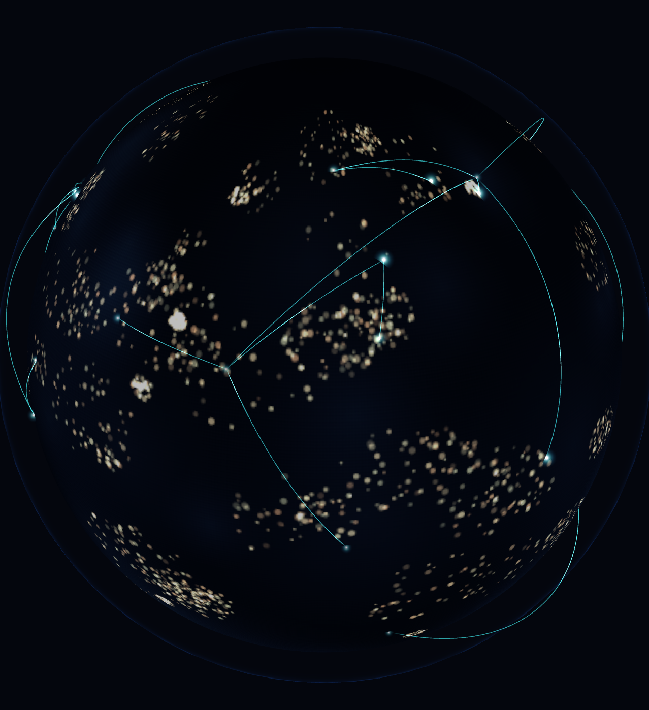
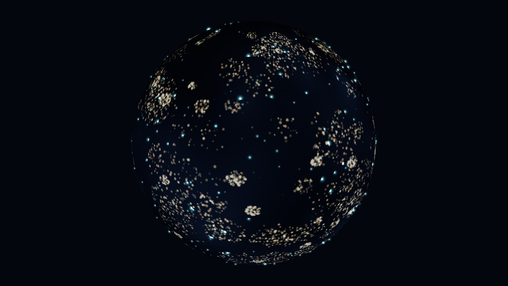
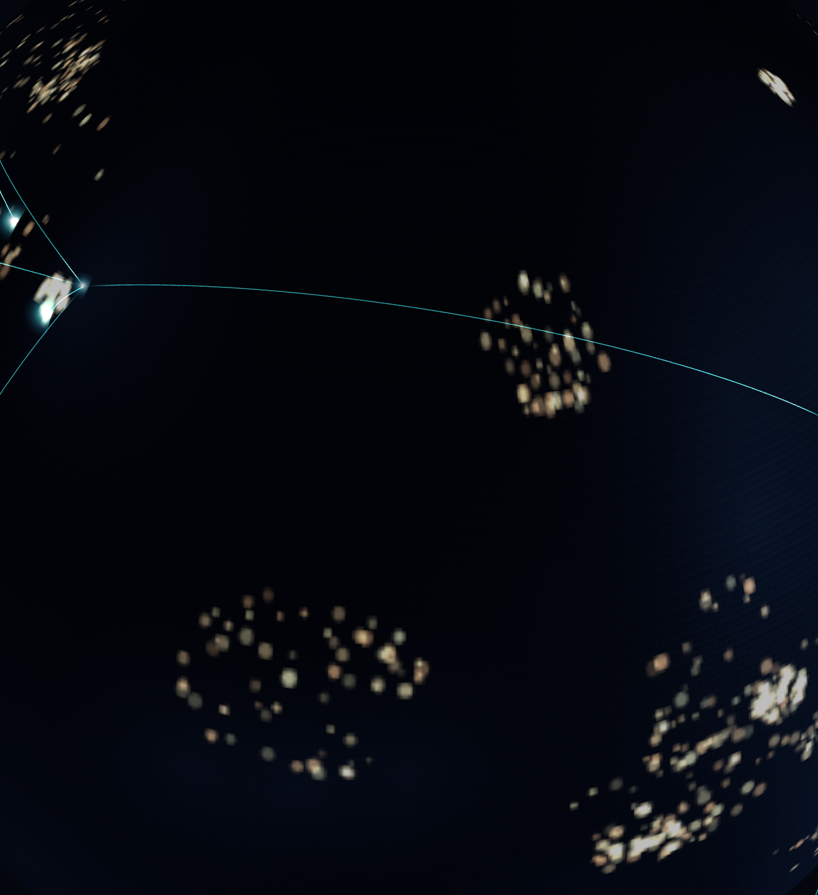

# DreamGlobe

An interactive 3D night-Earth globe for the web. Drop it into a page, hand it a
list of coordinates, and get a draggable, zoomable planet with glowing markers,
animated great-circle routes and a smooth camera flight to any location.

**[▶ Live demo](https://dream-globe.pages.dev)** — drag to spin, click a marker,
fly to a city.



Built on [Three.js](https://threejs.org/). No framework required — it works with
plain `<script>` tags, and it works inside React, Vue or Svelte.

---

## Why this exists

Most globe widgets fall over in the same three places: they issue one draw call
per marker and stall at a few hundred points, they block first paint on an 8K
texture, and they ship a camera that fights the user. DreamGlobe is built around
those constraints.

**1,000 markers and 200 arcs render in 4 draw calls at a median of 6.1 ms per
frame.** Everything is instanced or merged into shared buffers, so adding points
costs memory, not draw calls.

---

## Install

```bash
npm install three
```

Then copy `src/` into your project, or build the bundles:

```bash
npm install
npm run build
```

This produces two files in `dist/`:

| File | Format | Use |
| --- | --- | --- |
| `dream-globe.es.js` | ES module | Bundlers — Vite, webpack, Rollup |
| `dream-globe.iife.js` | IIFE | A plain `<script>` tag |

---

## Quick start

### With a bundler

```js
import { DreamGlobe } from 'dream-globe'

const globe = new DreamGlobe(document.querySelector('#globe'))

globe.addMarkers([
  { lat: 51.5074, lng: -0.1278, data: { title: 'London' } },
  { lat: 35.6762, lng: 139.6503, data: { title: 'Tokyo' } },
])

globe.addArc([51.5074, -0.1278], [35.6762, 139.6503])

globe.on('markerclick', (marker) => {
  console.log(marker.data.title)
})
```

### With a script tag

```html
<div id="globe" style="width: 100%; height: 500px"></div>
<script src="dist/dream-globe.iife.js"></script>
<script>
  const globe = new DreamGlobe(document.querySelector('#globe'))
  globe.addMarker(51.5074, -0.1278, { title: 'London' })
</script>
```

The container needs a height. Everything else — the render loop, resizing,
pixel-ratio capping, cleanup — is handled internally.

---

## Features

### Instanced markers



Every marker lives in a single `InstancedMesh`. Adding the 1,000th marker costs
one matrix write, not a new draw call. The buffer grows by doubling, so bulk
loads do not thrash the GPU.

```js
const id = globe.addMarker(48.8566, 2.3522, { title: 'Paris', population: '11M' })

globe.addMarkers([
  { lat: 40.71, lng: -74.01, data: { title: 'New York' }, color: 0xff9944 },
  { lat: -33.87, lng: 151.21, data: { title: 'Sydney' }, scale: 1.4 },
])

globe.removeMarker(id)
globe.clearMarkers()
```

Markers face the camera at all times — the billboard is applied in the vertex
shader, which means the CPU never touches a matrix during rotation.

### Great-circle arcs



Arcs follow the shortest path over the sphere and lift with distance, so a
transpacific route arcs high and a city hop stays low. All arcs merge into one
`LineSegments` geometry: 200 routes, one draw call.

```js
globe.addArc([51.5074, -0.1278], [40.7128, -74.006])

globe.addArcs([
  { from: [35.68, 139.69], to: [-33.87, 151.21] },
  { from: [1.35, 103.82], to: [25.20, 55.27], color: 0xffaa55 },
])
```

Segment counts scale with arc length — a fixed count either facets the long
routes or wastes vertices on the short ones.

### Camera flight

```js
await globe.flyTo(35.6762, 139.6503, { distance: 2.0, duration: 1200 })
```

The camera interpolates in spherical coordinates and always takes the short way
round, even after the user has dragged the globe through several full turns.
The promise resolves when the flight lands — or immediately if a second flight
or a drag interrupts it, so `await` never hangs.

### Progressive textures

The globe is interactive within a frame or two. It starts on a procedurally
generated placeholder — dark ocean, clustered city lights, seeded so it is
byte-identical on every run — and swaps in real imagery when it arrives.

```js
const globe = new DreamGlobe(el, {
  textureUrl: '/textures/earth-night-8k.jpg',
})

globe.on('textureload', () => console.log('real imagery is live'))
```

If the load fails, the placeholder simply stays. The globe never goes blank.

Texture resolution is chosen from viewport width, not a user-agent string:

| Viewport | Texture |
| --- | --- |
| ≤ 480 px | 2048 |
| ≤ 1024 px | 4096 |
| > 1024 px | 8192 |

```js
const size = globe.suggestedTextureSize // 2048 | 4096 | 8192
```

### Export a frame

```js
const dataUrl = globe.captureFrame()
```

Returns a PNG data URL. The canvas is transparent by design so the globe can sit
over a page background, but an exported image almost never wants that — dropped
into a document it lands on white and a night-side Earth vanishes. So capture
composites onto an opaque colour by default.

```js
globe.captureFrame({ background: null })            // keep alpha
globe.captureFrame({ type: 'image/jpeg', quality: 0.9 })
```

---

## Performance

Measured on a desktop browser at 1278 × 1398 backing resolution, timed over 200
frames through `requestAnimationFrame`.

| Scene | Draw calls | Median frame | Rate |
| --- | --- | --- | --- |
| 1,000 markers + 200 arcs | **4** | 6.1 ms | 166 fps (display-capped) |
| 5,000 markers + 200 arcs | **4** | — | 0.18 ms CPU submit |

p95 frame time at 1,000 markers is 6.4 ms — 0.3 ms above the median, so frame
pacing is stable rather than merely fast on average.

Picking a marker out of 1,000 costs **0.35 ms**, which is a screen-space
distance test rather than a raycast against instanced geometry.

Four draw calls total: Earth, atmosphere, all markers, all arcs. That number
does not change as the dataset grows.

Mobile behaviour is not an afterthought:

- Device pixel ratio is capped at 2. A phone at DPR 3 renders nine times the
  pixels of DPR 1 for a difference nobody can see on a glowing sphere.
- Sphere tessellation drops to 48 segments below 600 px — **2,208 triangles
  versus 9,024 on desktop, 76% fewer.**
- The placeholder texture is generated at 1024 px on phones instead of 2048,
  because generating it costs main-thread time at the exact moment the page is
  trying to become interactive.

---

## API

### `new DreamGlobe(container, options?)`

| Option | Type | Default | Description |
| --- | --- | --- | --- |
| `textureUrl` | `string` | — | Equirectangular night-lights image |
| `autoRotate` | `boolean` | `true` | Idle spin, stops on interaction |
| `markerColor` | `number` | `0x7ce4ff` | Default marker colour |
| `arcColor` | `number` | `0x7ce4ff` | Default arc colour |
| `maxPixelRatio` | `number` | `2` | DPR ceiling |

### Methods

| Method | Returns | Description |
| --- | --- | --- |
| `addMarker(lat, lng, data?, options?)` | `number` | Marker id |
| `addMarkers(list)` | `number[]` | Bulk add |
| `removeMarker(id)` | `boolean` | |
| `clearMarkers()` | | |
| `addArc(from, to, options?)` | `number` | Arc id |
| `addArcs(list)` | `number[]` | Bulk add |
| `removeArc(id)` | `boolean` | |
| `clearArcs()` | | |
| `flyTo(lat, lng, options?)` | `Promise<void>` | |
| `setTexture(url, onProgress?)` | `Promise<boolean>` | `false` if the load failed |
| `captureFrame(options?)` | `string` | Data URL |
| `on(event, handler)` | `() => void` | Returns an unsubscribe function |
| `off(event, handler)` | | |
| `dispose()` | | Releases all GPU resources |

### Events

| Event | Payload |
| --- | --- |
| `markerclick` | `{ id, lat, lng, data }` |
| `textureload` | `{ url }` |

A click is distinguished from a drag with 6 px of slop — a globe gets dragged
constantly, and firing `markerclick` at the end of every drag would be
maddening.

### Cleanup

```js
globe.dispose()
```

Cancels the render loop, disconnects observers, removes listeners and disposes
every geometry, material and texture. Call it when unmounting.

---

## Notes on the implementation

A few decisions that are not obvious from the API:

**Markers are picked in screen space, not by raycasting.** Once the billboard
transform is applied in the vertex shader, the CPU-side geometry no longer
matches what is on screen, so a raycast tests the wrong orientation. Projecting
each marker and comparing screen distance is both correct and cheaper.

**Far-side markers are rejected by a dot product**, not by depth testing — a
marker behind the globe projects onto the same screen pixels as one in front,
and must not be clickable.

**The atmosphere fades by radial distance, not by a Fresnel term.** A Fresnel
dot product does not converge at the shell's own silhouette, so the glow stays
bright where the geometry runs out and terminates in a hard circle — it reads as
a drawn ring around the planet rather than as scattered light. Distance-based
falloff reaches exactly zero at the shell edge, so the edge never appears.

**Damping is frame-rate independent.** `alpha = 1 - exp(-damping * dt / 16.667)`
means a 144 Hz monitor and a 60 Hz monitor settle at the same rate.

**No `Math.random` anywhere.** The placeholder texture and every animation
offset come from a seeded PRNG, so renders are reproducible across machines.

**The window is resolved from the container element**, not from the global, so
the widget works inside an iframe or a popped-out window and does not throw on
import during server-side rendering.

---

## Development

```bash
npm install
npm run dev        # http://127.0.0.1:5175
npm test           # 86 tests
npm run lint
npm run build      # library bundles -> dist/
npm run build:demo # the demo site above -> dist-demo/
```

The test suite covers coordinate conversion round-trips, great-circle geometry,
marker picking including back-face rejection, arc bounds, the texture ladder and
camera behaviour. Several tests exist specifically to pin down bugs that were
caught by rendering and measuring actual frames — arc peak height against the
camera's near limit, the atmosphere's falloff reaching zero, and the fact that
layers rebuild lazily and must be flushed before any render outside the
animation loop.

## Browser support

Any browser with WebGL 2: Chrome, Firefox, Safari 15+, Edge. Touch gestures —
drag to rotate, pinch to zoom — are supported.

## License

MIT
